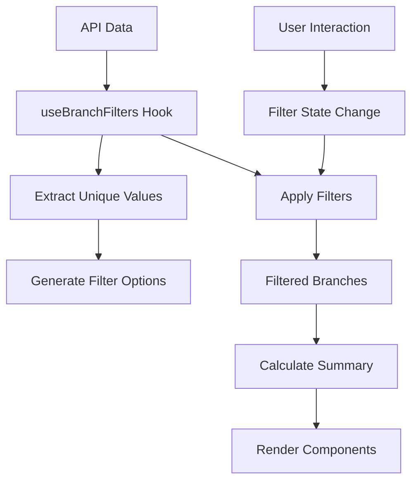

# Daily Sales Branches - Filtros de Región y Marca

## 📋 Descripción General

Los filtros de región y marca son una funcionalidad avanzada del componente `daily-sales-branches` que permite a los usuarios filtrar las sucursales por ubicación geográfica y marca comercial, proporcionando una vista personalizada de los datos de ventas diarias.

## 🎯 Características Principales

### ✨ Funcionalidades Core
- **Filtrado por Región**: Dropdown con todas las regiones disponibles en los datos
- **Filtrado por Marca**: Dropdown con todas las marcas comerciales disponibles
- **Filtrado Combinado**: Los filtros trabajan en conjunto para refinar los resultados
- **Tarjeta Resumen**: Muestra métricas agregadas de los datos filtrados
- **Performance Optimizada**: Filtrado client-side sin llamadas API adicionales

### 🎨 Diseño y UX
- **Tema Adaptativo**: Compatible con modo claro y oscuro
- **Diseño Minimalista**: Interface limpia y profesional
- **Responsive**: Funciona correctamente en dispositivos móviles y desktop
- **Accesibilidad**: Cumple estándares WCAG 2.1

## 🏗️ Arquitectura del Sistema

### 📁 Estructura de Archivos

```
daily-sales-branches/
├── types.ts                              # Interfaces TypeScript actualizadas
├── hooks/
│   └── use-branch-filters.ts             # Hook principal de filtrado
└── components/
    ├── branch-filters.tsx                # Componente de dropdowns
    ├── branch-summary-card.tsx           # Tarjeta de resumen
    └── daily-sales-branches-skeleton.tsx # Loading states actualizados
```

### 🔄 Flujo de Datos



## 🛠️ Implementación Técnica

### 📊 Tipos de Datos

```typescript
// Estado de filtros
interface BranchFiltersState {
    selectedRegion: string;  // 'all' | región específica
    selectedBrand: string;   // 'all' | marca específica
}

// Opciones de filtros
interface FilterOptions {
    regions: Array<{ value: string; label: string }>;
    brands: Array<{ value: string; label: string }>;
}

// Resumen de datos filtrados
interface FilteredSummary {
    totalSales: number;
    branchCount: number;
    // Métricas simplificadas para UX óptimo
}
```

### 🎣 Hook Principal: `useBranchFilters`

```typescript
const {
    filters,           // Estado actual de filtros
    setFilters,        // Función para actualizar filtros
    filteredBranches,  // Sucursales después del filtrado
    filterOptions,     // Opciones disponibles para dropdowns
    summary,          // Métricas agregadas
    hasActiveFilters  // Indica si hay filtros aplicados
} = useBranchFilters(branchesData);
```

### 🧮 Algoritmo de Filtrado

```typescript
// Filtrado optimizado con useMemo
const filteredBranches = useMemo(() => {
    return branches.filter(branch => {
        // Filtro por región
        const regionMatch = filters.selectedRegion === 'all' ||
                           branch.location === filters.selectedRegion;

        // Filtro por marca
        const brandMatch = filters.selectedBrand === 'all' ||
                          branch.brand === filters.selectedBrand;

        return regionMatch && brandMatch;
    });
}, [branches, filters]);
```

## 🎨 Guía de Diseño

### 🎭 Sistema de Temas

#### Variables CSS Utilizadas
```css
/* Filtros */
--background         /* Fondo de triggers */
--border            /* Bordes de elementos */
--foreground        /* Texto principal */
--ring              /* Color de focus */

/* Dropdowns */
--popover           /* Fondo del dropdown */
--popover-foreground /* Texto del dropdown */
--accent            /* Estados hover/focus */
--accent-foreground /* Texto en estados activos */
```

#### Dimensiones Estándar
```css
/* Altura consistente con MainFilterCalendar */
.filter-trigger {
    height: 36px; /* h-9 */
    width: 160px; /* w-[160px] */
}

/* Dropdown optimizado */
.filter-content {
    max-height: 200px; /* max-h-[200px] */
    z-index: 50;      /* z-50 */
}
```

### 📱 Responsive Design

#### Breakpoints
- **Mobile**: Filtros en columna vertical
- **Tablet+**: Filtros en fila horizontal
- **Desktop**: Layout completo optimizado

#### Espaciado
```css
.filters-container {
    gap: 8px;        /* gap-2 */
    padding: 16px;   /* px-4 py-3 */
}

.summary-card {
    margin-bottom: 12px; /* mb-3 */
    border-radius: 8px;  /* rounded-lg */
}
```

## 📊 Métricas y Analytics

### 🔢 Cálculos de Resumen

```typescript
// Total de ventas filtradas
const totalSales = filteredBranches.reduce((sum, branch) =>
    sum + branch.totalSales, 0
);

// Contador de sucursales
const branchCount = filteredBranches.length;

// Formateo de moneda mexicana
const formattedSales = new Intl.NumberFormat('es-MX', {
    style: 'currency',
    currency: 'MXN'
}).format(totalSales);
```

### 📈 Indicadores de Performance

- **Filtrado**: O(n) tiempo lineal
- **Memoria**: Mínimo overhead con useMemo
- **Re-renders**: Optimizados con React.memo
- **API Calls**: Cero llamadas adicionales

## 🔧 Configuración y Uso

### 🚀 Implementación Básica

```tsx
// En el componente principal
import { useBranchFilters } from './hooks/use-branch-filters';
import { BranchFilters } from './components/branch-filters';
import { BranchSummaryCard } from './components/branch-summary-card';

function DailySalesBranches({ selectedDateRange }) {
    const { branchesData } = useDailyBranchesSimple(selectedDateRange);

    const {
        filters,
        setFilters,
        filteredBranches,
        filterOptions,
        summary,
        hasActiveFilters
    } = useBranchFilters(branchesData);

    return (
        <Card>
            <CardContent>
                {/* Header */}
                <HeaderSection />

                {/* Filtros */}
                <BranchFilters
                    filters={filters}
                    filterOptions={filterOptions}
                    onFiltersChange={setFilters}
                />

                {/* Resumen */}
                <BranchSummaryCard
                    summary={summary}
                    hasActiveFilters={hasActiveFilters}
                />

                {/* Lista filtrada */}
                {filteredBranches.map(branch => (
                    <BranchCollapsibleItem key={branch.id} branch={branch} />
                ))}
            </CardContent>
        </Card>
    );
}
```

### ⚙️ Opciones de Personalización

```typescript
// Hook con configuración personalizada
const filterConfig = {
    defaultRegion: 'all',
    defaultBrand: 'all',
    enableMultiSelect: false, // Futuro enhancement
    sortOptions: 'alphabetical'
};
```

## 🔍 Debugging y Troubleshooting

### 🐛 Problemas Comunes

#### 1. Dropdowns No Visibles
**Síntoma**: Elementos cortados o no visibles
**Solución**: Verificar z-index y position="popper"

```tsx
<SelectContent
    className="z-50 max-h-[200px] overflow-y-auto"
    position="popper"
    sideOffset={4}
>
```

#### 2. Filtros No Funcionan
**Síntoma**: Los filtros no actualizan la lista
**Solución**: Verificar que los datos tienen las propiedades correctas

```typescript
// Verificar estructura de datos
console.log('Branch data:', {
    hasLocation: !!branch.location,
    hasBrand: !!branch.brand,
    location: branch.location,
    brand: branch.brand
});
```

#### 3. Performance Lenta
**Síntoma**: Lag al cambiar filtros
**Solución**: Verificar dependencias de useMemo

```typescript
// Dependencies correctas
const filteredBranches = useMemo(() => {
    return filterLogic();
}, [branches, filters]); // Solo estas dependencias
```

### 📝 Logging para Debug

```typescript
// En development
if (process.env.NODE_ENV === 'development') {
    console.group('🔍 Branch Filters Debug');
    console.log('Available regions:', availableRegions);
    console.log('Available brands:', availableBrands);
    console.log('Current filters:', filters);
    console.log('Filtered results:', filteredBranches.length);
    console.groupEnd();
}
```

## 🚀 Replicación a Otros Componentes

### 📋 Checklist para Replicar

- [ ] **Copiar hook**: `use-branch-filters.ts`
- [ ] **Adaptar componentes**: `branch-filters.tsx` y `branch-summary-card.tsx`
- [ ] **Actualizar tipos**: Agregar interfaces necesarias
- [ ] **Integrar en componente principal**
- [ ] **Actualizar skeleton loading**
- [ ] **Testing y validación**

### 🔄 Componentes Objetivo

1. **weekly-sales-branches** - Prioritario
2. **monthly-sales-branches** - Medio
3. **custom-sales-branches** - Bajo

### 📝 Adaptaciones Necesarias

```typescript
// Para weekly-sales-branches
const { branchesData } = useWeeklyBranches(selectedDateRange);

// Para monthly-sales-branches
const { branchesData } = useMonthlyBranches(selectedDateRange);

// Para custom-sales-branches
const { branchesData } = useCustomBranches(selectedDateRange);
```

## 📚 Referencias Técnicas

### 🔗 Dependencias
- **shadcn/ui**: Select components
- **Lucide React**: Iconografía
- **React 19**: Hooks y optimizaciones
- **TypeScript**: Type safety

### 📖 Documentación Relacionada
- [Main Filter Calendar](./main-filter-calendar.md)
- [Daily Sales Branches](./daily-sales-branches.md)
- [Theme System](../theme/theme-system.md)
- [Performance Guidelines](../performance/optimization.md)

---

**Versión**: 1.0.0
**Fecha**: Septiembre 2025
**Mantenedor**: CostenoSalesV3 Development Team
**Estado**: ✅ Producción