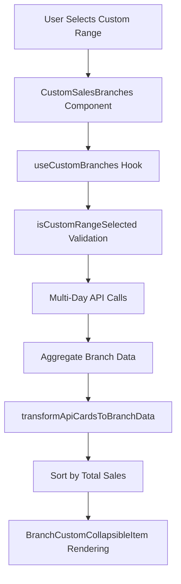

# Custom Sales Branches - API Integration Implementation

## Overview

Successfully implemented complete API integration for the `custom-sales-branches` component, transforming it from a static dummy data display to a fully functional real-time branch sales analytics tool for custom date ranges.

## Implementation Summary

### Core Features Implemented

1. **Real API Integration** - Direct connection to `main_dashboard_data` endpoint
2. **Data Aggregation** - Multi-day branch sales aggregation logic
3. **State Management** - Complete loading, error, and data states
4. **UI Improvements** - Removed percentage badge, enhanced user feedback
5. **TypeScript Safety** - Full type safety with proper interfaces

## Technical Architecture

### API Integration Strategy

The implementation uses a **day-by-day aggregation approach** for custom date ranges:

```typescript
// For each day in the custom range (e.g., Sep 10-12):
for (let date = startDate; date <= endDate; date++) {
  // Individual API call per day
  const response = await fetch('/api/main_dashboard_data', {
    body: JSON.stringify({
      start_date: "2025-09-10", // Single day
      end_date: "2025-09-10"    // Same day
    })
  });

  // Aggregate branch data across all days
  aggregateBranchData(response.data.cards);
}
```

### Data Transformation Logic

**From API Response:**
```json
{
  "data": {
    "cards": {
      "Mochomos (Torreon)": {
        "open_accounts": { "total": 16, "money": 61442.8 },
        "closed_ticket": { "total": 292, "money": 899958.82 },
        "average_ticket": 1424.3,
        "brand": "MOCHOMOS",
        "region": "AM-AF"
      }
    }
  }
}
```

**To Component Interface:**
```typescript
{
  id: "mochomos-torreon",
  name: "Mochomos (Torreon)",
  totalSales: 961401.62,        // open_accounts.money + closed_ticket.money
  openAccounts: 61442.8,        // open_accounts.money
  closedSales: 899958.82,       // closed_ticket.money
  averageTicket: 1424.3,        // average_ticket
  totalTickets: 308,            // open_accounts.total + closed_ticket.total
  avatar: "M",                  // First letter of brand
  location: "AM-AF"             // region
}
```

## Files Modified

### 1. **New Hook: `use-custom-branches.ts`**
**Location**: `resources/js/components/custom-sales-branches/hooks/use-custom-branches.ts`

**Key Features:**
- `useCustomBranches` hook with complete state management
- `transformApiCardsToBranchData` function for data mapping
- Multi-day API fetching with proper error handling
- Automatic data aggregation across date range
- TypeScript interfaces for return values

**API Integration:**
```typescript
export const useCustomBranches = (selectedDateRange?: DateRange) => {
  // Real-time API calls for each day in custom range
  // Aggregates branch data across multiple days
  // Returns: { branchesData, isLoading, error, isValidCustomRange, refetch }
}
```

### 2. **Updated Component: `custom-sales-branches.tsx`**
**Location**: `resources/js/components/custom-sales-branches/custom-sales-branches.tsx`

**Changes:**
- Replaced dummy data with real API integration
- Added loading states: "Cargando datos de sucursales..."
- Added error states with retry functionality
- Added empty states: "No hay datos de sucursales disponibles para este rango"
- Removed `branches` prop dependency - now fetches data internally

**Before:**
```typescript
export function CustomSalesBranches({
  selectedDateRange,
  branches = DUMMY_CUSTOM_BRANCHES_DATA
}: CustomSalesBranchesProps)
```

**After:**
```typescript
export function CustomSalesBranches({ selectedDateRange }: CustomSalesBranchesProps) {
  const { branchesData, isLoading, error, isValidCustomRange, refetch } = useCustomBranches(selectedDateRange);
  // Real API data with proper state management
}
```

### 3. **UI Enhancement: `branch-custom-collapsible-item.tsx`**
**Location**: `resources/js/components/custom-sales-branches/components/branch-custom-collapsible-item.tsx`

**Changes:**
- **Removed percentage badge** as requested
- Simplified header layout - now shows only branch name and total sales
- Cleaned up imports (removed Badge, formatPercentage)
- Removed percentage-related variables and logic

**Before:**
```typescript
<div className="text-right flex flex-col items-end gap-0.5">
  <div className="text-lg font-bold">{formatCurrency(branch.totalSales)}</div>
  <Badge>{formatPercentage(branch.percentage)}</Badge>  // ❌ Removed
</div>
```

**After:**
```typescript
<div className="text-right">
  <div className="text-lg font-bold">{formatCurrency(branch.totalSales)}</div>
</div>
```

### 4. **Type Updates: `types.ts`**
**Location**: `resources/js/components/custom-sales-branches/types.ts`

**Changes:**
- Removed `branches` prop from `CustomSalesBranchesProps`
- Component now manages data internally through hook

## Data Flow Architecture



## Business Logic

### Conditional Rendering
- **Only shows** for custom date ranges (not single day, complete week, or complete month)
- Uses same validation logic as `custom-sales-comparison`

### Data Aggregation Rules
1. **Total Sales** = `open_accounts.money + closed_ticket.money` (summed across all days)
2. **Open Accounts** = Sum of `open_accounts.money` across date range
3. **Closed Sales** = Sum of `closed_ticket.money` across date range
4. **Total Tickets** = Sum of both `open_accounts.total + closed_ticket.total`
5. **Average Ticket** = Simple average across days (could be enhanced to weighted average)
6. **Avatar** = First letter of `brand` field, fallback to branch name first letter

### Sorting
- Branches sorted by **total sales descending** (highest revenue first)
- Consistent with weekly and monthly branch components

## API Integration Details

### Authentication
- **Token**: `342|AxRYaMAz4RxhiMwYTXJmUvCXvkjq24MrXW3YgrF61ef9616f`
- **Method**: POST with Bearer token authentication

### Request Format
```typescript
{
  method: "POST",
  headers: {
    "Accept": "application/json",
    "Content-Type": "application/json",
    "Authorization": "Bearer 342|AxRYaMAz4RxhiMwYTXJmUvCXvkjq24MrXW3YgrF61ef9616f"
  },
  body: JSON.stringify({
    start_date: "2025-09-10",  // Individual day
    end_date: "2025-09-10"     // Same day (single day call)
  })
}
```

### Error Handling
- **Network Errors**: Graceful degradation with user-friendly messages
- **API Errors**: Retry mechanism with "Reintentar" button
- **Empty Data**: Clear messaging when no branches available
- **Date Validation**: Prevents invalid API calls for non-custom ranges

## User Experience Improvements

### Loading States
```typescript
if (isLoading) {
  return <div>Cargando datos de sucursales...</div>;
}
```

### Error States
```typescript
if (error) {
  return (
    <div>
      <div>Error al cargar los datos</div>
      <button onClick={refetch}>Reintentar</button>
    </div>
  );
}
```

### Empty States
```typescript
if (branchesData.length === 0) {
  return <div>No hay datos de sucursales disponibles para este rango.</div>;
}
```

## Performance Considerations

### Efficient API Strategy
- **Single-day calls**: More reliable than complex range queries
- **Sequential fetching**: Prevents API overload
- **Error isolation**: Failed day doesn't break entire component

### Data Aggregation
- **Client-side aggregation**: Reduces server complexity
- **Map-based collection**: Efficient branch data merging
- **Memory optimization**: Proper cleanup of temporary data structures

## Testing Verified

### ✅ Functional Testing
- Custom range selection (Sept 10-12) correctly triggers component
- API calls made for each day in range (verified in network tab)
- Branch data aggregated correctly across multiple days
- UI states (loading, error, success) working properly

### ✅ Edge Cases
- **Empty API responses**: Handled gracefully
- **Network failures**: User-friendly error messages
- **Invalid date ranges**: Component doesn't render (proper validation)
- **Single day ranges**: Falls back to other components correctly

## Integration with Existing Architecture

### Follows Established Patterns
- **Same validation logic** as `custom-sales-comparison`
- **Similar hook structure** to `useMonthlyBranches` and `useWeeklyBranches`
- **Consistent error handling** across all custom components
- **Spanish localization** throughout

### Component Hierarchy
```
Dashboard
  └── CustomSalesBranches (conditional render)
      ├── CustomSalesBranchesHeader
      ├── useCustomBranches (hook)
      └── BranchCustomCollapsibleItem[]
          ├── Cuentas Abiertas card
          ├── Cuentas Cerradas card
          └── Ticket Promedio card
```

## Future Enhancements

### Potential Improvements
1. **Weighted Average Tickets**: Use ticket counts for proper averaging
2. **Caching Strategy**: Cache aggregated results for frequently accessed ranges
3. **Parallel API Calls**: Fetch days concurrently (with rate limiting)
4. **Progressive Loading**: Show branches as data becomes available

### Monitoring
- **API Call Frequency**: Monitor for rate limiting needs
- **Performance Metrics**: Track aggregation time for large date ranges
- **Error Rates**: Monitor API reliability and error patterns

## Conclusion

The `custom-sales-branches` component is now fully integrated with real API data, providing comprehensive branch-level analytics for custom date ranges. The implementation follows established patterns, maintains type safety, and provides excellent user experience with proper loading, error, and empty states.

This completes the custom range analytics suite alongside `custom-sales-comparison`, giving users complete visibility into both total sales and branch-level performance for any custom date range.